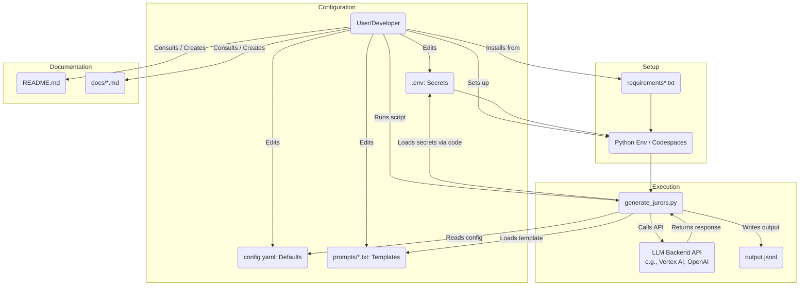

# jurDroids a virtual Juror profile generator

**This tool integrates the customization of LLMs to generate diverse, simulated juror profiles for testing and analysis within decentralized justice systems like Kleros (not afiliated).** 
**This repository provides the instructions for its development, customization, and test execution.**


## Overview

This repository contains the documentation and code for an AI tool that uses Large Language Models (LLMs) to create varied and nuanced juror profiles. These generated profiles are intended **strictly for simulation, testing, and research purposes** related to decentralized justice systems.

Conceptually, this tool functions as an **agentic AI system**. It takes high-level instructions and uses LLM capabilities (potentially including planning, reasoning, and using specific knowledge sources) to generate complex, structured outputs in the form of juror profiles. For a deeper dive into Agentic AI concepts, see the video linked in the [Further Reading](#further-reading--conceptual-background) section.

The primary goals of this project and runbook are to:

1. Provide a framework for **generating synthetic juror data** reflecting potential real-world diversity and specific simulated characteristics.
2. Offer clear instructions for **setting up a development environment** to work on the generation logic.
3. Guide users on **customizing the generation process** for modifying prompts, parameters and juror archetypes.
4. Detail how to **run the tool to generate test batches** of juror profiles.


**Ethical Considerations & Disclaimer:**
*This tool generates synthetic data for **testing and simulation only**. The generated profiles may inadvertently reflect biases present in the underlying LLM training data. They should **never** be used to make assumptions about real individuals or influence real dispute resolutions. Use responsibly and be aware of the limitations and potential ethical implications.*

## Table of Contents

* [Who is this for?](#who-is-this-for)
* [Prerequisites](#prerequisites)
* [Getting Started](#getting-started)
    * [Cloning the Repository](#cloning-the-repository)
    * [Installation & Setup](#installation--setup)
    * [Backend Configuration (LLM Access)](#backend-configuration-llm-access)
* [Runbook Sections](#runbook-sections)
    * [1. Development Environment](./docs/development.md)
    * [2. Customizing Juror Generation](./docs/customization.md)
    * [3. Generating Test Profiles (Running the Tool)](./docs/generating-profiles.md)
* [Technology Stack](#technology-stack)
* [Output Format & Traceability](#output-format--traceability)
* [Further Reading / Conceptual Background](#further-reading--conceptual-background)
* [Troubleshooting](#troubleshooting)
* [Contributing](#contributing)
* [License](#license)
* [Contact](#contact)

## Who is this for?

* **Researchers & Analysts:** Simulating court scenarios, testing mechanism designs, studying potential voting patterns.
* **Developers:** Working on the juror generation tool itself or integrating simulated jurors into other Kleros-related testing tools.
* **Protocol Developers:** Stress-testing Kleros contracts with diverse simulated juror data.

## Prerequisites

Before you begin, ensure you have:

* **Git:** For cloning the repository and version control.
* **Programming Language & Version:** Python 3.9+
* **Package Manager:** pip
* **Command line interface:** Windows PowerShell, Google Cloud SDK, Azure CLI, GitHub Codespaces 
* **LLM Access:** An API key for a large languaje model service such as OpenAI, xAI, Anthropic, Cohere or access to a local LLM setup.
* **Basic understanding of:** LLMs, prompt engineering, Python development, and cd cthe Kleros protocol.

## Diagram


## Getting Started

### Cloning the Repository

```bash
git clone https://github.com/MAMware/court-jurdroids.git
cd court-jurdroids
```

### Installation & Setup

1.  **Recommended: Set up a Virtual Environment**
    **On Linux/Mac**
    ```bash
    python -m venv venv
    source venv/bin/activate
     ```
    **On Windows**
    ```bash
    python -m venv venv
    venv\Scripts\activate
    ```
    Troubleshooting
    If an error appears on windows while trying to setup the virtual environment and it is due to a security exception where the Activate.ps1 cannot be loaded becouse of the running scripts are disablabed on your system, to enable try to execute:
    ```bash
    Set-ExecutionPolicy -ExecutionPolicy RemoteSigned -Scope CurrentUser
    ```

2.  **Install Dependencies:**
    ```bash
    pip install -r requirements.txt
    ```

### Backend Configuration (LLM Access)

This tool is designed to be potentially adaptable to various LLM backends. The core configuration happens via environment variables and potentially configuration files (`config.yaml`).

### API Key Configuration

The tool requires access to an LLM API. 

*Important:** Configure your API key securely, ensure `.env` is in `.gitignore`.

**Environment Variables (`.env`):** Primarily used for API keys and secrets.

1.  Copy and rename the example environment file and edit the .env with your specific keys and endpoints
    ```bash
    cp .env.example .env
      ```
     
2.  **Configuration File `config.yaml`:** For non-sensitive settings like default model parameters, prompt template paths, etc.

## Runbook Sections

This repository is structured around the core tasks. Follow the guides linked below for detailed instructions:

1.  **[Development Environment](./docs/development.md):** Setting up for coding, debugging, testing.
2.  **[Customizing Juror Generation](./docs/customization.md):** Modifying the logic. Key areas include:
    * **Prompt Engineering:** Adjusting the text prompts sent to the LLM default_propmt.txt . 
    * **Generation Parameters:** Tweaking settings like `temperature`, `top_p`, `max_tokens` (often configurable via `config.yaml` or command-line args).
    * **Backend Logic:** Modifying the Python code (`generate_jurors.py` or similar) to handle different LLM clients (OpenAI, Anthropic, VertexAI, Hugging Face Transformers, local models via libraries like `litellm` or custom wrappers), potentially using different parameters or prompt formats suited to each.
    * **Archetype Definition:** Changing how different types of jurors are defined or requested.
3.  **[Generating Test Profiles (Running the Tool)](./docs/generating-profiles.md):** Executing the main generation script (e.g., `python generate_jurors.py --count 10 --output profiles.json`). This guide details command-line arguments and usage.

## Technology Stack

* **Core Language:** Python 
* **LLM Interaction (to test):**  OpenAI Lib, (Langchain, Hugging Face Transformers, Google Vertex AI SDK, LiteLLM {for multi-backend support})
* **Tested supported Backends (to do):**  OpenAI API, (Azure OpenAI, Google Vertex AI, Anthropic API, Hugging Face Inference API/Transformers, Local models via Ollama or LM Studio compatible API).
* **Environment Management:** python-dotenv, PyYAML.

## Output Format & Traceability

The tool outputs profiles one JSON object per line in a file. A key goal is **traceability** for reproducibility and analysis. Each generated profile should include metadata

* See `./docs/output-schema.md`for details.

## Further Reading / Conceptual Background

**Understanding Agentic AI:** For a good overview of the concepts behind agentic systems, language models, prompting strategies, and design patterns that might be relevant to this tool, its recommened to watch this video *Stanford Webinar - Agentic AI: A Progression of Language Model Usage* [Agentic AI Overview & Concepts](https://www.youtube.com/watch?v=kJLiOGle3Lw) there you will find an introduction to the concept of agentic language models (LMs) and their usage. Common limitations of LMs and agentic LM usage patterns, such as reflection, planning, tool usage, and iterative LM usage. 


## Troubleshooting 

For common issues please refer to the [troubleshooting](./docs/troubleshooting.md).


## Contributing 

Contributions are welcome! If you want to improve the generation logic, add features, or enhance the documentation:

1.  Fork the repository.
2.  Create a new branch (`git checkout -b feature/your-improvement`).
3.  Make your changes.
4.  Ensure your changes are well-documented, tested, adhering to ethical guidelines.
5.  Commit your changes (`git commit -m 'Add feature: your improvement'`).
6.  Push to the branch (`git push origin feature/your-improvement`).
7.  Open a Pull Request.


## License

This project is licensed under the Creative Commons Attribution-NonCommercial 4.0 International Public License - see the [LICENSE](LICENSE) file for details.

## Contact

* For questions or support, please open an issue on GitHub.
* Project Maintainer: MAMware, contributors welcomed!

<!-- ----------------------------------------------------------------- -->


Current README.md is at beta stage v0.1.0, it is tested working against xAI API.
To do:
Feature: load multple juror profiles, ie: sorted by state at `/prompts` directory.
Wireframe: plan for agentic reasoning and using specific knowledge sources like [Kleros_IO](https://github.com/kleros/kleros-v2)
Agent Concepts/Patterns: may employ techniques discussed in Agentic AI research, such as advanced prompting, planning and reflection.
Improve the Retrieval-Augmented Generation (RAG) to enhance profile quality and consistency. (See [Further Reading](#further-reading--conceptual-background)).
Data Handling: e.g., Pandas, JSON, YAML
Other Libraries: e.g., Scikit-learn for bias analysis
LLM Interaction to test:  Google Vertex AI SDK, Langchain, Hugging Face Transformers, LiteLLM for multi-backend support.
Testing with backends:  OpenAI API, Azure OpenAI, Google Vertex AI, Anthropic API, Hugging Face Inference API/Transformers, Local models via Ollama or LM Studio compatible API.
Troubleshooting: contribute to the knowledge base (file to create)

**When contributing its recommended to keep this document updated:** As the development or deployment process changes, remember to update the README and related documents.

Welcome!


